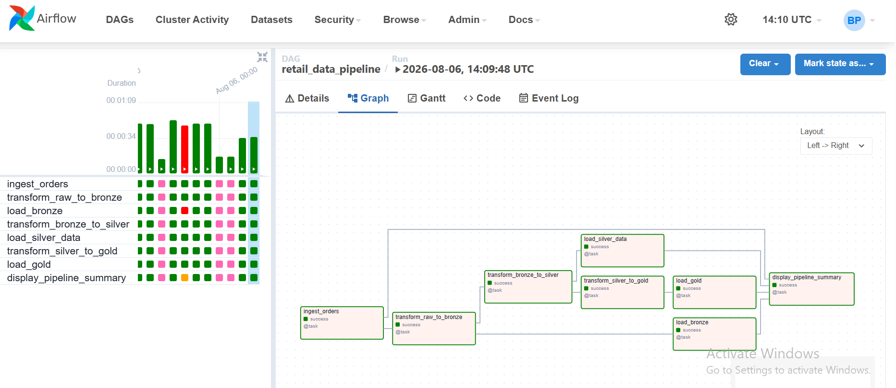
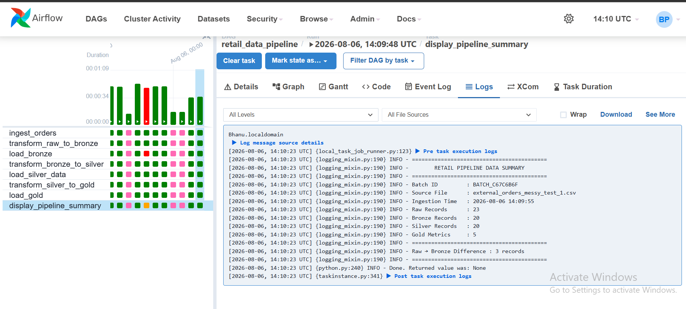
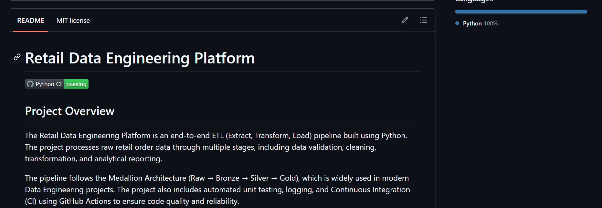
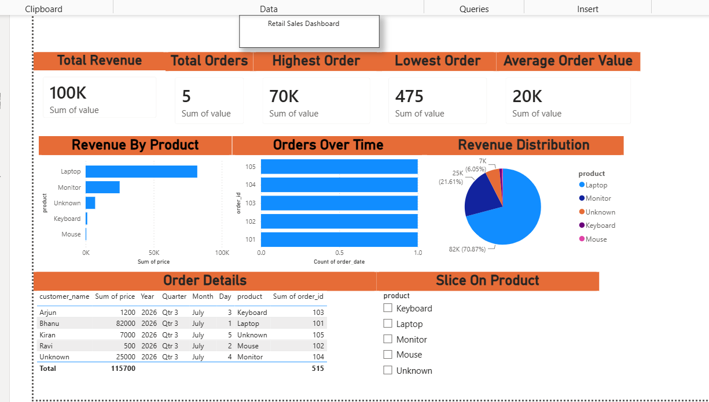
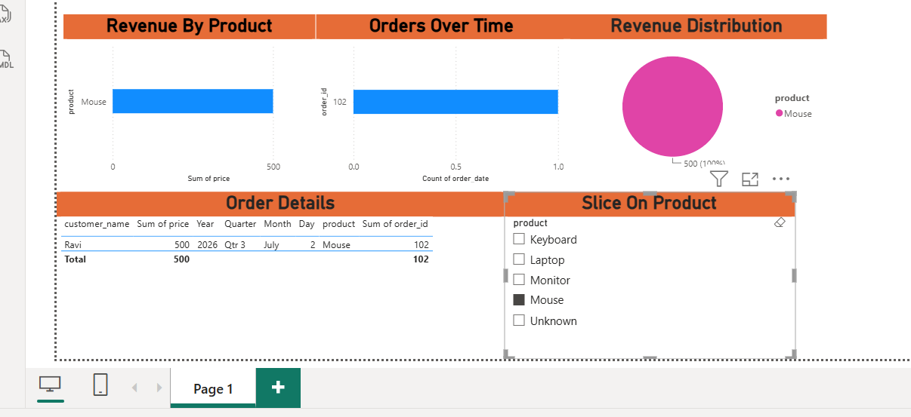

# Retail Data Engineering Platform


[](https://github.com/Bhanu73120/retail-data-engineering-platform/actions/workflows/python-app.yml)


An end-to-end Retail Data Engineering project that implements a complete ETL pipeline using Python, Apache Airflow, MySQL, and GitHub Actions.

The pipeline processes retail order CSV files through a manually triggered Apache Airflow DAG, validates and cleans the data, applies business rules, generates analytical summaries, and loads processed data into MySQL using a Raw → Bronze → Silver → Gold architecture.

## 🎯 Problem Statement

Retail transaction data often arrives as raw CSV files containing duplicate records, inconsistent customer and product information, and data that is not immediately suitable for analytics.

This project builds an ETL pipeline that transforms raw retail order data into clean, validated, and analytics-ready datasets using a layered data architecture.

The pipeline demonstrates how raw transactional data can be progressively processed through Raw, Bronze, Silver, and Gold layers before being stored in MySQL and used for downstream analytics.

---

# Project Architecture

```
                External CSV Files
                        │
                        ▼
              Airflow DAG Trigger
                        │
                        ▼
                Raw Data Ingestion
                        │
                        ▼
              Data Validation
                        │
                        ▼
            Customer & Product Cleaning
                        │
                        ▼
             Duplicate Removal
                        │
                        ▼
                 Bronze Layer
                        │
                        ▼
            Business Rule Processing
                        │
                        ▼
                 Silver Layer
                        │
                        ▼
          Sales Summary Generation
                        │
                        ▼
                  Gold Layer
                        │
                        ▼
                MySQL Data Warehouse
```


## Airflow DAG




## Successful Pipeline Run




## GitHub Actions




## Power BI Dashboard



## Power BI Dashboard By Product



---

# Features

- ETL pipeline orchestration using Apache Airflow
- Dynamic Batch ID generation
- Source file tracking
- Ingestion timestamp tracking
- Raw → Bronze → Silver → Gold architecture
- Data validation before and after cleaning
- Customer data cleaning
- Product data cleaning
- Duplicate removal
- Business rule implementation
- Sales summary generation
- MySQL data warehouse loading
- Structured logging
- Unit testing using Pytest
- Code coverage using pytest-cov
- Continuous Integration using GitHub Actions

---

# Tech Stack

- Python 3.11
- Apache Airflow 2.10
- MySQL
- Pandas
- NumPy
- Pytest
- Git
- GitHub
- GitHub Actions

---

## 📁 Project Structure

retail-data-engineering-platform/
│
├── airflow/
│   └── dags/                  # Airflow DAG definitions
│
├── data/
│   ├── raw/                   # Raw ingested data
│   ├── bronze/                # Standardized and deduplicated data
│   ├── silver/                # Cleaned and validated data
│   └── gold/                  # Business-ready aggregated data
│
├── scripts/
│   ├── data_download.py       # Raw data ingestion
│   ├── raw_to_bronze.py       # Raw → Bronze processing
│   ├── bronze_to_silver.py    # Bronze → Silver transformation
│   └── silver_to_gold.py      # Silver → Gold aggregation
│
├── src/
│   ├── ingestion/             # Data ingestion logic
│   ├── transformation/        # Cleaning and business rules
│   ├── warehouse/             # Final data storage logic
│   └── utils/                 # Shared utilities
│
├── tests/                     # Pipeline tests
├── docs/                      # Architecture and screenshots
├── requirements.txt
├── .gitignore
└── README.md

---

# ETL Pipeline

## Raw Layer

- Reads retail CSV files
- Generates Batch ID
- Stores source filename
- Stores ingestion timestamp

---

## Bronze Layer

- Validates input data
- Removes duplicate records
- Cleans customer names
- Cleans product names

---

## Silver Layer

Applies business rules:

- Price Category
- Discount
- Final Price

---

## Gold Layer

Generates analytical metrics:

- Total Revenue
- Total Orders
- Average Order Value
- Highest Order Value
- Lowest Order Value

---

# MySQL Tables

The pipeline loads processed data into three tables.

## orders

Stores cleaned Bronze layer data.

## orders_silver

Stores business-rule enriched Silver layer data.

## sales_summary

Stores Gold layer analytical metrics.

Each batch includes:

- Batch ID
- Source File
- Ingestion Timestamp

---

# Running the Project

## Clone Repository

```bash
git clone https://github.com/Bhanu73120/retail-data-engineering-platform.git
```

---

## Move into Project

```bash
cd retail-data-engineering-platform
```

---

## Create Virtual Environment

### Windows

```bash
python -m venv venv
venv\Scripts\activate
```

### Linux

```bash
python3 -m venv venv
source venv/bin/activate
```

---

## Install Dependencies

```bash
pip install -r requirements.txt
```

---

## Configure Airflow

Configure:

- Airflow Variables
- MySQL Connection

Place CSV files into:

```
External_CSVs/incoming/
```

Run the DAG:

```
retail_data_pipeline
```

---

# Running Tests

Run all tests

```bash
pytest
```

Run with coverage

```bash
python -m pytest --cov=src
```

---

# Continuous Integration

GitHub Actions automatically runs:

- Dependency installation
- Unit tests
- Code coverage

Every push to the `main` branch is automatically validated.

---

# Project Documentation

Detailed setup guides are available inside the `docs` folder.

- project_overview.md
- airflow_setup.md
- mysql_setup.md
- pipeline_execution.md

---

# Dashboard

Power BI dashboard is available in:

```
dashboards/powerbi/
```

Pipeline screenshots are available in:

```
dashboards/screenshots/
```

# Author

**Bhanu Prakash**

GitHub:

https://github.com/Bhanu73120
